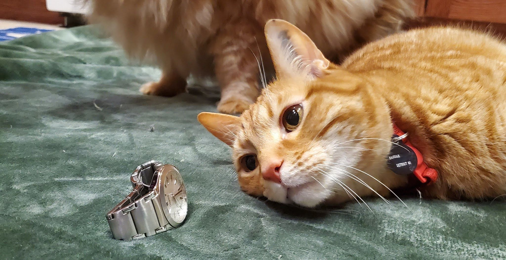

# Critter-Chronologer
Critter Chronologer is an API that provides a scheduling interface for a small business that takes care of animals. 
This Spring Boot project will allow users to create pets, owners, and employees, and then schedule events for employees to provide services for pets.

